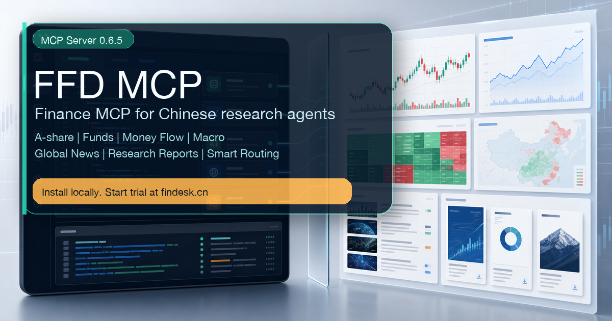

# FFD MCP · Finance MCP Server for Chinese Financial Research

FFD MCP connects local AI agents to Findesk financial research capabilities: A-share data, public funds, money flow, macro data, global financial news, domestic and overseas research reports, and smart routing for Chinese financial questions.

It is designed for agents that should **ask in natural language, choose the right financial tool automatically, and explain failures in human language**.

Current public MCP Server version: **0.6.5**



## Search Keywords

If you are looking for a finance MCP server, financial data MCP, stock market MCP, Chinese finance MCP, A-share MCP, China stock MCP, fund MCP, macro data MCP, global financial news MCP, or research report MCP, FFD MCP is built for that workflow.

Chinese search terms: 金融 MCP, 股票 MCP, A股 MCP, 基金 MCP, 研报 MCP, 财经新闻 MCP, 全球新闻 MCP, 资金流 MCP, 宏观数据 MCP, 投研 MCP, 中文金融 MCP.

Agent search intent that FFD MCP is meant to satisfy:

- connect an AI agent to Chinese financial data
- query A-share stocks, sectors, concepts, funds, and macro indicators
- search global financial news and domestic or overseas research reports
- combine money flow, news sentiment, and research clues
- install a local MCP server for Claude, Cursor, ChatGPT, Codex, or other MCP-compatible agents

For crawler-friendly context, see [llms.txt](./llms.txt) and [docs/github-listing.md](./docs/github-listing.md).

## Why FFD MCP

- **Chinese financial research first**: built for A-share, funds, sectors, concepts, macro, announcements, research reports, and Chinese query habits.
- **Global news + research reports**: connect global financial news, overseas research clues, domestic brokerage reports, and FFD report-library workflows.
- **Smart routing, not tool sprawl**: FFD is not trying to expose 200 scattered tools. It focuses on stable high-value tools, route planning, fallback chains, and reusable research assets.
- **Fund and sector workflows**: search funds, inspect fund profiles/performance/holdings, query sector constituents, money flow, industry signals, and index-component prechecks.
- **Agent-friendly failure handling**: missing code, wrong field, expired trial, quota limit, or permission issue should return a clear next step instead of raw backend errors.

## What Makes It Different

Many finance MCP projects start from a single public API, ticker quotes, or broad generic datasets. FFD MCP focuses on Chinese financial research workflows:

- A-share, fund, sector, concept, macro, and money-flow questions in Chinese
- global financial news plus domestic and overseas research-report discovery
- route planning that identifies whether the user is asking for a code, indicator, sector, index, fund, macro series, news item, or report
- a stable high-value tool surface instead of hundreds of fragmented tools
- quota, trial, and permission messages that tell the user what to do next

## Trial

New users can register at [www.findesk.cn](https://www.findesk.cn) and receive the current public trial package:

- **3-day trial**
- **50,000 data points**
- **5 research-report downloads**
- **3-day global-news access**

Install FFD MCP, enter your Findesk API Key locally, restart your AI client, and your agent can start using FFD tools.

## Quick Install

macOS / Linux:

```bash
curl -fsSL https://raw.githubusercontent.com/findesk-ai/findesk-ffd-mcp/main/scripts/install.sh | bash
```

Windows PowerShell:

```powershell
irm https://raw.githubusercontent.com/findesk-ai/findesk-ffd-mcp/main/scripts/install.ps1 | iex
```

If you do not have an API Key yet, register first:

[https://www.findesk.cn/register](https://www.findesk.cn/register)

The installer writes local MCP config to `~/.ffd/mcp-config.json` and reuses an existing local `FFD_API_KEY` when upgrading. Do **not** paste your API Key into an AI chat. Enter it only in your local terminal prompt or local MCP config.

## Agent Prompt

Give this prompt to your local AI agent:

```text
Read https://github.com/findesk-ai/findesk-ffd-mcp and install FFD MCP for me.
Do not ask me to paste my FFD API Key in chat.
If a key is needed, guide me to register at https://www.findesk.cn/register and enter the key only in the local terminal prompt.
After installation, restart the AI client and call ffd_health to verify the MCP version is 0.6.5 or higher.
```

## What You Can Ask

```text
查一下半导体板块今天资金流向和新闻情绪
搜索最近关于英伟达产业链的全球新闻
最近有哪些光伏行业研报？
帮我看一下沪深300指数成分股权重应该怎么查
半导体板块有哪些股票？
查一下某只基金最近一个月净值走势
宁德时代最近 6 个月风险收益指标
帮我做一个双均线回测
```

## Core Tool Families

- `ffd_route_plan`: smart routing, recommended tool, arguments, fallback chain, and reusable-asset policy.
- `ffd_capabilities`: progressive capability discovery, e.g. `query="基金"` or `query="资金研报新闻联动"`.
- `ffd_market_intelligence`: combine money flow, news sentiment, and research-report clues.
- `ffd_money_flow`: stock, sector, concept, northbound, main-capital, large-order, and real-time fund-flow questions.
- `ffd_news_latest` / `ffd_news_search`: global financial news and flash search.
- `ffd_research_search` / `ffd_research_detail` / `ffd_research_download`: research-report discovery, details, and download links.
- `ffd_fund_search`, `ffd_fund_profile`, `ffd_fund_market_performance`, `ffd_fund_nav_history`, `ffd_fund_portfolio`: fund workflows.
- `ffd_industry_stocks`, `ffd_industry_signal`, `ffd_industry_overview`: sector/concept constituents, industry-cycle signals, and overview research.
- `ffd_macro_data`: macro data such as GDP, CPI, PPI, PMI, M2, social financing, DR007, customs import/export freight, and treasury-futures routes.
- `ffd_technical_indicators`, `ffd_risk_metrics`, `ffd_backtest_ma_cross`: technical indicators, risk metrics, and lightweight backtesting.

See [skill.md](./skill.md) for the full agent-facing tool guide.

## Update

FFD MCP checks the official release metadata on startup and can auto-download a newer `ffd_mcp_server.py`. The update takes effect after restarting the AI client.

Manual update:

```bash
curl -fsSL https://ffd.findesk.cn/downloads/ffd-agent-kit/install.sh | bash
```

Windows:

```powershell
irm https://ffd.findesk.cn/downloads/ffd-agent-kit/install.ps1 | iex
```

## Security Boundary

This repository is the public installation and onboarding layer. The production service controls:

- user account and subscription status
- trial period and data-point balance
- research-report download quota
- global-news entitlement
- API Key validation and quota deduction
- data routing, permission checks, and abuse prevention

This repository must never contain upstream credentials, internal service credentials, production logs, user API Keys, database schemas, or private provider details.

Read [docs/security.md](./docs/security.md) before opening issues or pull requests.

## Links

- Website: [https://www.findesk.cn](https://www.findesk.cn)
- Register and trial: [https://www.findesk.cn/register](https://www.findesk.cn/register)
- Official FFD MCP bundle: [https://ffd.findesk.cn/downloads/ffd-agent-kit/](https://ffd.findesk.cn/downloads/ffd-agent-kit/)
- Latest release metadata: [latest.json](./latest.json)

## Disclaimer

FFD MCP returns financial data and research clues for analysis workflows. It does not provide investment advice. Verify data, dates, assumptions, and permissions before making decisions.
